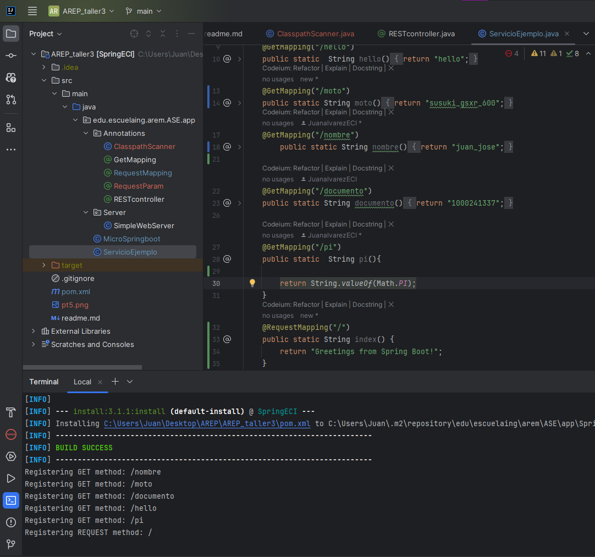
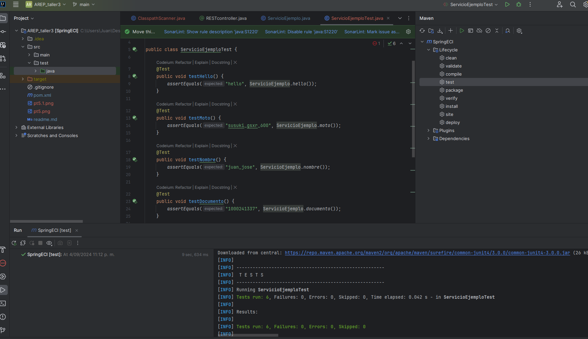

# 🚀 Taller de Arquitecturas de Servidores de Aplicaciones, Meta Protocolos de Objetos, Patrón IoC, y Reflexión
Para este taller los estudiantes deberán construir un servidor Web (tipo Apache) en Java. El servidor debe ser capaz de entregar páginas html e imágenes tipo PNG. Igualmente el servidor debe proveer un framework IoC para la construcción de aplicaciones web a partir de POJOS. Usando el servidor se debe construir una aplicación Web de ejemplo. El servidor debe atender múltiples solicitudes no concurrentes.

Para este taller desarrolle un prototipo mínimo que demuestre capcidades reflexivas de JAVA y permita por lo menos cargar un bean (POJO) y derivar una aplicación Web a partir de él.

Debe entregar su trabajo al final del laboratorio. Luego puede complementar para entregarlo en 8 días. Se verificara y compararán el commit del día de inicio del laboratorio y el dela entrega final.
## 🏛️ Arquitectura

La arquitectura de la aplicación se basa en un servidor web simple implementado en Java que utiliza reflexión para descubrir y manejar controladores REST anotados. La clase principal MicroSpringboot escanea el classpath en busca de clases anotadas con @RestController y registra sus métodos anotados con @GetMapping o @RequestMapping. El servidor web, implementado en SimpleWebServer, escucha en un puerto específico y maneja solicitudes HTTP, invocando métodos en los controladores registrados. La utilidad ClasspathScanner facilita la detección dinámica de controladores REST en el classpath. Los controladores, como ServicioEjemplo, definen varios endpoints para manejar diferentes rutas HTTP. La aplicación sigue el patrón de Inversión de Control (IoC) para la gestión de dependencias y el ciclo de vida de los objetos.
### 🔧 Componentes Principales
- **MicroSpringboot**: Clase principal que inicia el servidor web y registra los controladores REST. Escanea el classpath en busca de clases anotadas con @RestController y registra sus métodos anotados con @GetMapping o @RequestMapping..
- **SimpleWebServer**: Implementa un servidor web simple que escucha en un puerto específico y maneja solicitudes HTTP. Utiliza reflexión para invocar métodos en los controladores registrados.
- **ClasspathScanner**: Utilidad para escanear el classpath en busca de clases con una anotación específica (@RestController). Ayuda a descubrir y cargar dinámicamente los controladores REST.
- **ServicioEjemplo**: Ejemplo de controlador REST anotado con @RestController. Define varios endpoints utilizando @GetMapping y @RequestMapping para manejar diferentes rutas HTTP.
- **Anotaciones Personalizadas**: Anotaciones como @RESTcontroller, @GetMapping, y @RequestMapping que se utilizan para marcar y mapear métodos en los controladores REST.

## 🛠️ Empezando
### ✅ Requisitos Previos

Asegúrate de tener instalados los siguientes componentes:

- [Java JDK 17](https://www.oracle.com/java/technologies/javase-jdk17-downloads.html).
- Un IDE de Java como [IntelliJ IDEA](https://www.jetbrains.com/idea/), [Eclipse](https://www.eclipse.org/downloads/), o [NetBeans](https://netbeans.apache.org/).
- [Maven](https://maven.apache.org/) Manejo de las dependencias.
- Un navegador web.

### 📥 Instalación

1. Instala [Git](https://git-scm.com/downloads).
2. Elige una carpeta para alojar el repositorio.
3. Abre la terminal de Git con clic derecho y selecciona "Git Bash Here".
4. Clona el repositorio en tu máquina local:
   ```bash
    git clone https://github.com/Medina95/Taller3_AREM.git
   ```
## 🚀 Despliegue
1. Abre el proyecto con tu IDE favorito.
2. Compila el proyecto ejecutando:
   ```bash
   mvn clean install
   ```
3. Ejecuta el servidor:
   El servidor estará corriendo en el puerto 8080
   ```bash
   java -cp target/classes edu.escuelaing.arem.ASE.app.MicroSpringboot
   ```
   

4. Ahora puedes interactuar con los endpoints RESTful disponibles:
- http://localhost:8080/nombre -> retorna el nombre del estudiante alojado en la variable name
-  http://localhost:8080/moto -> retorna el objeto moto alojado en la variable moto
-   http://localhost:8080/documento -> retorna el objeto documento alojado en la variable documento
-   http://localhost:8080/hello -> retorna un saludo
-   http://localhost:8080/pi -> retorna el valor de pi
-   http://localhost:8080/ -> retorna un mensaje de bienvenida con el metodo RequestMapping
## 🧪 Ejecutar los Test
1. Desde tu IDE, ejecuta la clase AppTest.java o desde la terminal:
   ```bash
    mvn test
   ```

### 🔍 Explicación Test
1. test del metodo hello: Verifica que el método hello devuelva la cadena "hello".
2. test del metodo moto: Verifica que el método moto devuelva la cadena "susuki_gsxr_600".
3. test del metodo nombre: Verifica que el método nombre devuelva la cadena "juan_jose".
4. test del metodo documento: Verifica que el método documento devuelva la cadena "1000241337".
5. test del metodo pi: Verifica que el método pi devuelva la representación en cadena del valor de Math.PI.
6. test del metodo index: Verifica que el método index devuelva la cadena "Greetings from Spring Boot!".